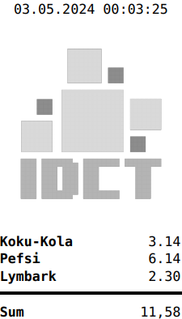

POS Printer PDF Generator
=========================

Toolchain which simplfies the process of PDFs generation out of HTML which can be used with POS receipt printers.

Allows conversion of HTML into long and narrow PDF files which can be passed to CUPS-compatible receipts printer.

Can process basic HTML 4 supported by `htmldoc`:
https://www.msweet.org/htmldoc/htmldoc.html

# Functions

```csharp
public Box HtmlToReceipt(string html, string outputFilePath, HtmldocOptions? htmldocOptions = null)
```

Main method which covers all of the others in a single process. Converts HTML string into a trimmed single-page PDF file. `htmldocOptions` allow to set width in milimeters, bottom padding to avoid exact trimming of the whitespace in the bottom of the file, default font and its size.

Returns `Box` which provides width and height in points, inches and milimeters, **useful for printers which require exact size to print on a paper roll**.

## Partial methods

```csharp
public void HtmlToPdf(string html, string outputFilePath, HtmldocOptions? htmldocOptions = null)
```

Converts HTML to a PDF file with parameters defined in htmldocOptions. By default a very long and narrow PDF. Main difference from `HtmlToReceipt` is the fact that this method does not call other functions like `CombineLongPdf` or `TrimPdf` which may result in multiple pages and no trimming of the remaining whitespace.


```csharp
public static void CombineLongPdf(string inputFilePath, string outputFilePath)
```

Combines pages of a PDF file into a single long page. Takes width from first page.


```csharp
public static Box TrimPdf(string inputFilePath, string outputFilePath, int bottomMargin = 0)
```

Trims a PDF file, removes remaining white space at the end, supports keeping a margin in pixels.

Returns `Box` which provides width and height in points, inches and milimeters, **useful for printers which require exact size to print on a paper roll**.

# Sample usage

Main namespace is `IODCT.Html2Pdf`, so for example to generate a simple receipt:

```csharp
using IDCT.Html2Pdf;

POSPrinterPdfGenerator generator = new();

string html = "" +
    "<html>" +
    "<body>" +
    "<center>" + DateTime.Now.ToLocalTime().ToString() + "</center>" +
    "<p></p>" +
    "<table>" +
    "<tr><td width='100%'><b>Koku-Kola</b></td><td>3.14</td>" +
    "<tr><td width='100%'><b>Pefsi</b></td><td>6.14</td>" +
    "<tr><td width='100%'><b>Lymbark</b></td><td>2.30</td>" +
    "</table>" +
    "<hr>" +
    "<table>" +
    "<tr><td width='100%'><b>Sum</b></td><td>11,58</td>" +
    "</table>" +
    "</body>" +
    "</html>";

var size = generator.HtmlToReceipt(html, "out.pdf", new HtmldocOptions() { Gray = true, PdfSupportedFont = PdfSupportedFont.Monospace });

Console.WriteLine(String.Format("Size in points: {0}x{1}pt", size.Width.Point, size.Height.Point));
Console.WriteLine(String.Format("Size in inches: {0}x{1}cm", size.Width.Inch, size.Height.Inch));
Console.WriteLine(String.Format("Size in milimeters: {0}x{1}mm", size.Width.Millimeter, size.Height.Millimeter));

```

Will result in a PDF looking like this:



Sample execution results also in output to console:

```bash
Size in points: 136x237pt
Size in inches: 1,8888888888888888x3,2916666666666665cm
Size in milimeters: 47,977777777777774x83,60833333333332mm
```

With some printers it may be require to provide exact size, for example with **Custom Engineering PLUS2**:
```bash
lpr -H 172.20.0.3 -o PrintDensity=7Density+37 -o PageSize=Custom.136x237pt -o orientation-requested=3 -P printer out.pdf
```


# Installation and requirements

Follow `nuget` instructions, for example to install with .NET Cli:
```bash
dotnet add package IDCT.PosPrinterPdfGenerator
```

Library supports Windows, OSX and Linux (tested on Debian and WSL).

`htmldoc` application is required. It must be installed in one of the following ways:

* Available in the system, for example by installing it using Windows installer, or by `apt get`. Ensure that it is present in PATH enviromental variable.
* By placing `htmldoc` in the same folder as your application which includes the library.
* By providing path to `htmldoc` in the constructor of the instance: `public POSPrinterPdfGenerator(string? htmldocPath = null)`

.NET 6 or newer is required.

Depends also on open-source projects:
* PDFsharp, version at least 6.0.0 (https://docs.pdfsharp.net/)
* Docnet.Core, version at least 2.6.0 (https://github.com/GowenGit/docnet)

# License

This application is **NOT FREE**, license needs to be obtained for personal and commercial use. License can be obtained on https://idct.tech. Until license is obtained a prefix saying that unlicensed library was used will be added in the beginning of converted files.

# Open Source Promise

Library will become open-source and available on Github in January 2026.

It is possible to obtain source code with the enterprise license.

# Support and troubleshooting

Support is provided via e-mail **support@idct.tech**.